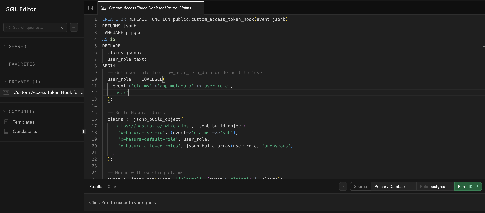
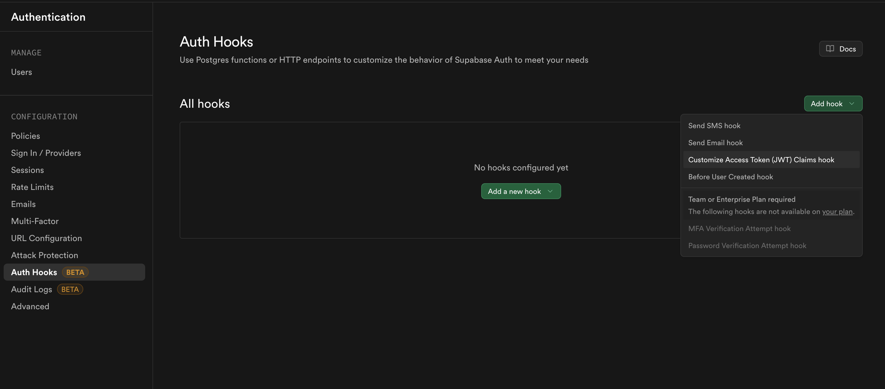
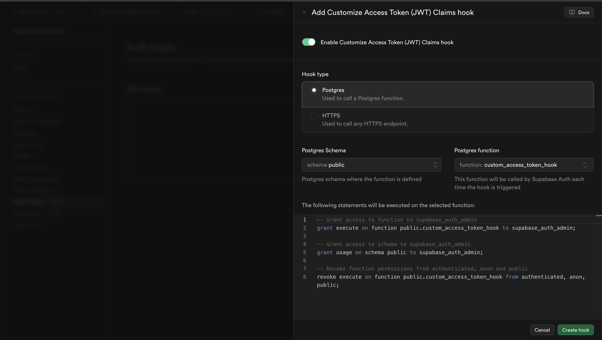
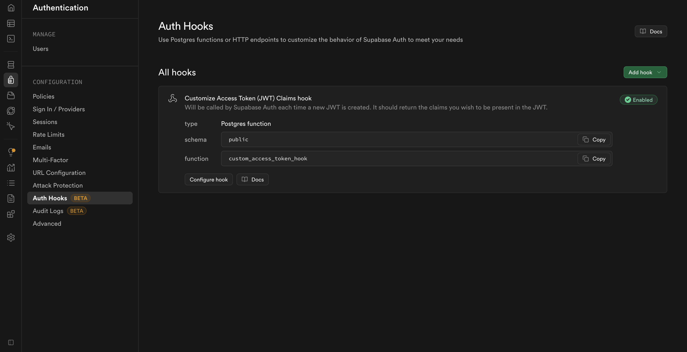
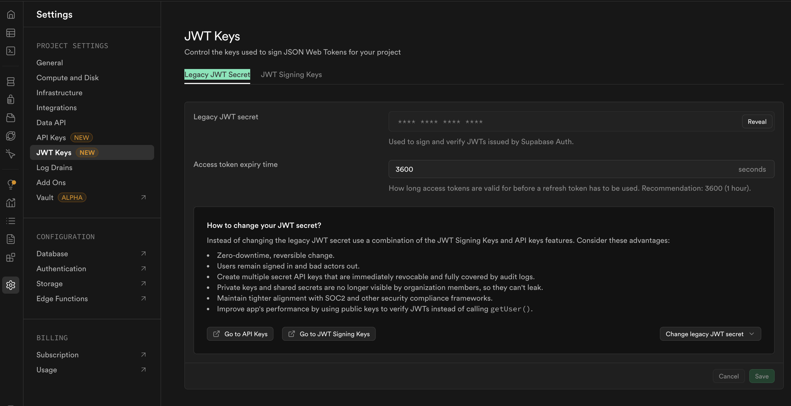
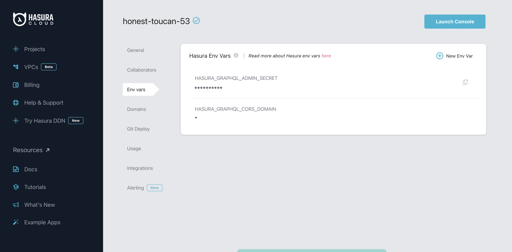
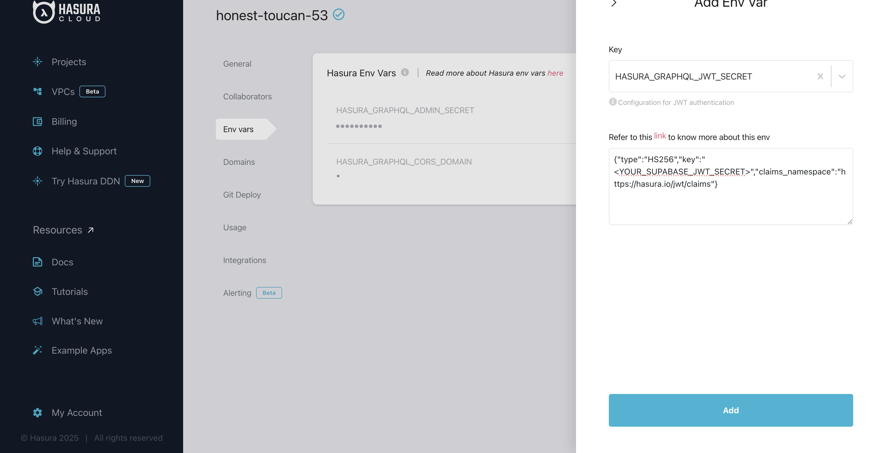

# Hasura RBAC with Supabase JWT Authentication

In this blog post, we will integrate Hasura RBAC with Supabase JWT Authentication.

## Prerequisites

- Supabase Project
- Hasura (Cloud or self-hosted)


### 1. **Add Custom Claims via Database Function**

Supabase includes custom claims in the JWT from the `raw_app_meta_data` field. You need to set up a database trigger to automatically add Hasura claims when users are created or updated.

Create this function in your Supabase SQL Editor:

```sql
-- Function to add Hasura claims to user metadata
CREATE OR REPLACE FUNCTION public.custom_access_token_hook(event jsonb)
RETURNS jsonb
LANGUAGE plpgsql
AS $$
DECLARE
  claims jsonb;
  user_role text;
BEGIN
  -- Get user role from raw_user_meta_data or default to 'user'
  user_role := COALESCE(
    event->'claims'->'app_metadata'->>'user_role',
    'user'
  );

  -- Build Hasura claims
  claims := jsonb_build_object(
    'https://hasura.io/jwt/claims', jsonb_build_object(
      'x-hasura-user-id', (event->'claims'->>'sub'),
      'x-hasura-default-role', user_role,
      'x-hasura-allowed-roles', jsonb_build_array(user_role, 'anonymous')
    )
  );

  -- Merge with existing claims
  event := jsonb_set(event, '{claims}', (event->'claims') || claims);

  RETURN event;
END;
$$;

-- Grant necessary permissions
GRANT USAGE ON SCHEMA public TO supabase_auth_admin;
GRANT EXECUTE ON FUNCTION public.custom_access_token_hook TO supabase_auth_admin;
REVOKE EXECUTE ON FUNCTION public.custom_access_token_hook FROM authenticated, anon, public;
```





### 2. **Enable the Hook in Supabase Dashboard**

1. Go to **Authentication** → **Auth Hooks** -> **Add Hook** -> **Customize Access Token (JWT) Claims hook**


2. Enable **Customize Access Token (JWT) Claims hook** and select the SQL function: `public.custom_access_token_hook`



3. Save and Verify that the hook is enabled




### 3. **Get Supabase JWT Secret**

1. Copy the **Legacy JWT Secret** from **Project Settings** → **JWT Keys**



### 4.1 **Configure Hasura Cloud**

1. Go to Hasura Cloud Dashboard open on **Env Vars**



2. Add `HASURA_GRAPHQL_JWT_SECRET` environment variable with the value of `{"type":"HS256","key":"<YOUR_SUPABASE_JWT_SECRET>","claims_namespace":"https://hasura.io/jwt/claims"}`. Don't forget to replace `<YOUR_SUPABASE_JWT_SECRET>` with your actual Supabase JWT Secret.



### 4.2 **Configure Hasura (Self-Hosted)**

Update your `docker-compose.yml` with `HASURA_GRAPHQL_JWT_SECRET` environment variable and restart the container:

```yaml:docker-compose.yml
  hasura:
    environment:
      # other settings...
      HASURA_GRAPHQL_JWT_SECRET: '{"type":"HS256","key":"<YOUR_SUPABASE_JWT_SECRET>","claims_namespace":"https://hasura.io/jwt/claims"}'
```