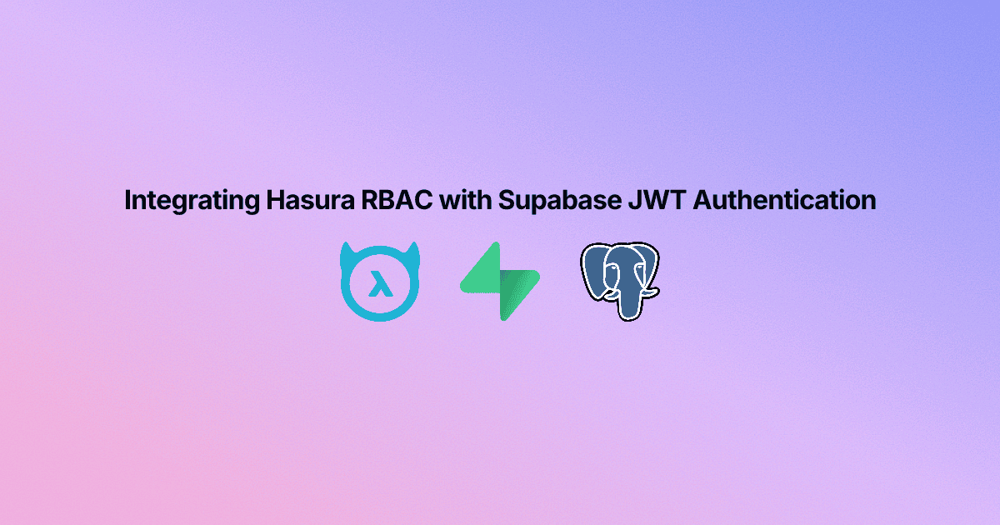
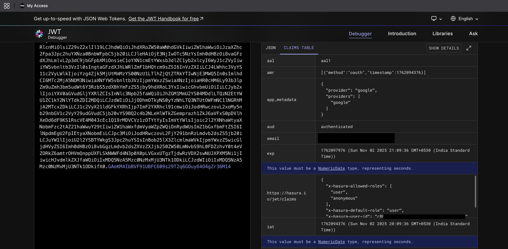
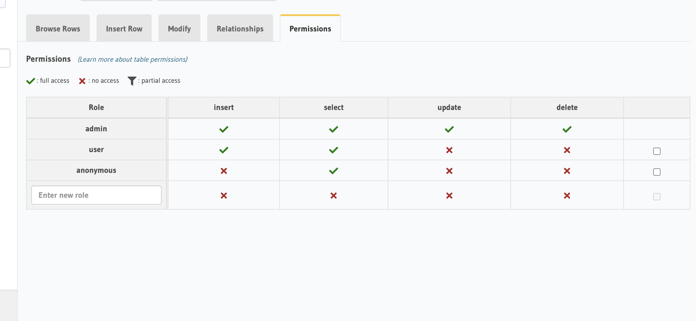

# Integrating Hasura RBAC with Supabase JWT Authentication

[](https://creativecommons.org/licenses/by-nc-sa/4.0/)


[](https://ysskrishna.vercel.app/blogs/integrating-hasura-rbac-with-supabase-jwt-authentication)



Welcome to this comprehensive guide on integrating Hasura Role-Based Access Control (RBAC) with Supabase JWT Authentication! If you're looking to build a secure, scalable application with fine-grained access control, this tutorial is for you. By the end, you'll have a seamless setup where Supabase handles user authentication and Hasura enforces role-based permissions, all connected through JSON Web Tokens (JWTs). Let's dive in!

## Table of Contents
- [Why Integrate Hasura with Supabase?](#why-integrate-hasura-with-supabase)
- [Prerequisites](#prerequisites)
- [Step 1: Add Custom Claims via Database Function](#step-1-add-custom-claims-via-database-function)
- [Step 2: Enable the Hook in Supabase Dashboard](#step-2-enable-the-hook-in-supabase-dashboard)
- [Step 3: Retrieve Supabase JWT Secret](#step-3-retrieve-supabase-jwt-secret)
- [Step 4: Configure Hasura](#step-4-configure-hasura)
  - [4.1 Hasura Cloud](#41-hasura-cloud)
  - [4.2 Self-Hosted Hasura](#42-self-hosted-hasura)
- [Step 5: Verify Hasura Claims in Supabase Access Tokens](#step-5-verify-hasura-claims-in-supabase-access-tokens)
- [Step 6: Set Up Hasura RBAC Permissions](#step-6-set-up-hasura-rbac-permissions)
- [Testing Your Integration](#testing-your-integration)
- [Troubleshooting Common Issues](#troubleshooting-common-issues)
- [Conclusion and Next Steps](#conclusion-and-next-steps)

## Why Integrate Hasura with Supabase?
Combining Hasura and Supabase offers the best of both worlds: Supabase provides a robust PostgreSQL database with built-in authentication, while Hasura delivers instant GraphQL APIs with powerful RBAC. This integration allows you to:
- Centralize user authentication with Supabase.
- Enforce detailed access control policies in Hasura using roles embedded in JWTs.
- Simplify development with automatic, secure data access tailored to user roles.

Whether you're building a simple web application or a complex SaaS platform, this setup ensures security and scalability. Ready to get started?

## Prerequisites
Before we begin, ensure you have:
- A **Supabase Project** set up with authentication enabled.
- A **Hasura** instance, either on Hasura Cloud or self-hosted.

If you haven't set these up yet, visit the [Supabase Dashboard](https://supabase.com/dashboard) and [Hasura Cloud](https://cloud.hasura.io/) to create your projects.

## Step 1: Add Custom Claims via Database Function
Supabase allows you to embed custom claims in JWTs using data from the `raw_app_meta_data` field in user profiles. We'll create a database function and trigger to automatically inject Hasura-specific claims (like user ID and roles) into the token whenever a user logs in or updates their profile.

**Why is this important?** Hasura uses these claims to identify users and enforce role-based permissions, ensuring that each user only accesses data they're authorized to see.

In your Supabase Dashboard, navigate to the SQL Editor and create the following function:

```sql
-- Function to add Hasura claims to user metadata
CREATE OR REPLACE FUNCTION public.custom_access_token_hook(event jsonb)
RETURNS jsonb
LANGUAGE plpgsql
AS $$
DECLARE
  claims jsonb;
  user_role text;
BEGIN
  -- Get user role from raw_user_meta_data or default to 'user'
  user_role := COALESCE(
    event->'claims'->'app_metadata'->>'user_role',
    'user'
  );

  -- Build Hasura claims
  claims := jsonb_build_object(
    'https://hasura.io/jwt/claims', jsonb_build_object(
      'x-hasura-user-id', (event->'claims'->>'sub'),
      'x-hasura-default-role', user_role,
      'x-hasura-allowed-roles', jsonb_build_array(user_role, 'anonymous')
    )
  );

  -- Merge with existing claims
  event := jsonb_set(event, '{claims}', (event->'claims') || claims);

  RETURN event;
END;
$$;

-- Grant necessary permissions
GRANT USAGE ON SCHEMA public TO supabase_auth_admin;
GRANT EXECUTE ON FUNCTION public.custom_access_token_hook TO supabase_auth_admin;
REVOKE EXECUTE ON FUNCTION public.custom_access_token_hook FROM authenticated, anon, public;
```


**Note**: Ensure the function name `custom_access_token_hook` matches exactly as shown, as Supabase looks for this specific name when enabling hooks.

## Step 2: Enable the Hook in Supabase Dashboard
Now that the function is created, you need to activate it as a hook in Supabase to modify JWTs during user authentication.

1. Navigate to **Authentication** → **Auth Hooks** → **Add Hook** → **Customize Access Token (JWT) Claims Hook**.
   
2. Enable the hook and select the SQL function `public.custom_access_token_hook` from the dropdown.
   
3. Save your changes and verify that the hook is enabled.
   

This step ensures that every time a user authenticates, the hook runs and embeds the Hasura claims into their JWT.

## Step 3: Retrieve Supabase JWT Secret
Hasura needs the Supabase JWT secret to validate the tokens issued by Supabase. This secret is used to sign the JWTs and must be shared with Hasura for secure communication.

1. In your Supabase Dashboard, go to **Project Settings** → **JWT Keys**.
2. Copy the **Legacy JWT Secret**. Keep this secure and do not expose it in public repositories.


**Warning**: If this secret is compromised, unauthorized parties could forge tokens. Treat it like a password.

## Step 4: Configure Hasura
With the JWT secret in hand, configure Hasura to recognize and validate Supabase-issued tokens. The setup differs slightly depending on whether you're using Hasura Cloud or a self-hosted instance.

### 4.1 Hasura Cloud
1. Log in to your Hasura Cloud Dashboard and select your project.
2. Go to **Env Vars** and add a new environment variable named `HASURA_GRAPHQL_JWT_SECRET`.
3. Set its value to `{"type":"HS256","key":"<YOUR_SUPABASE_JWT_SECRET>","claims_namespace":"https://hasura.io/jwt/claims"}`. Replace `<YOUR_SUPABASE_JWT_SECRET>` with the secret you copied earlier.
4. Save the changes.


### 4.2 Self-Hosted Hasura
If you're running Hasura locally or on your own server, update your `docker-compose.yml` file:

```yaml
hasura:
  environment:
    # other settings...
    HASURA_GRAPHQL_JWT_SECRET: '{"type":"HS256","key":"<YOUR_SUPABASE_JWT_SECRET>","claims_namespace":"https://hasura.io/jwt/claims"}'
```

Replace `<YOUR_SUPABASE_JWT_SECRET>` with your actual Supabase JWT secret, then restart the Hasura container to apply the changes.

## Step 5: Verify Hasura Claims in Supabase Access Tokens
Let's confirm that the Hasura claims are correctly embedded in the Supabase JWTs.

1. In your Supabase-integrated application, log in as a user to generate an access token.
2. Extract the `access_token` from the session object.
3. Paste it into [jwt.io](https://jwt.io/) to decode and inspect the token. You should see the Hasura claims under the namespace `https://hasura.io/jwt/claims`:

```json
{
  ...,
  "https://hasura.io/jwt/claims": {
    "x-hasura-allowed-roles": [
      "user",
      "anonymous"
    ],
    "x-hasura-default-role": "user",
    "x-hasura-user-id": "<user_uuid>"
  }
}
```



If you see these claims, congratulations! Your tokens are now carrying the necessary information for Hasura to enforce RBAC.

## Step 6: Set Up Hasura RBAC Permissions
With the claims in place, it's time to define permissions in Hasura based on the roles (`user` and `anonymous`) embedded in the JWT.

1. In the Hasura Console, navigate to the **Data** tab and select a table you want to secure.
2. Go to the **Permissions** tab and define rules for each role. For example:
   - `anonymous`: Allow only read access to public data.
   - `user`: Allow read and write access, restricted to data linked to `x-hasura-user-id`.
3. Save the permissions.



**Tip**: Use session variables like `x-hasura-user-id` in permission rules to create row-level security, ensuring users only access their own data.

## Testing Your Integration
Beyond decoding the JWT, test the integration end-to-end to ensure everything works as expected:
1. Log in to your application with a test user account.
2. Use a GraphQL client (or Hasura's API Explorer) to query data, passing the Supabase `access_token` as the `Authorization: Bearer <token>` header.
3. Verify that Hasura respects the roles and permissions. For instance, an `anonymous` user should be denied write access if configured as such.

If the query returns the expected data or an appropriate error based on permissions, your setup is working!

## Troubleshooting Common Issues
If you encounter problems, here are some common issues and solutions:
- **JWT Claims Not Appearing**: Ensure the Supabase hook is enabled and the function name matches `custom_access_token_hook`. Check for errors in the Supabase SQL Editor logs.
- **Hasura Rejects Tokens**: Verify that the `HASURA_GRAPHQL_JWT_SECRET` is correctly set with the right Supabase secret and that the `claims_namespace` matches `https://hasura.io/jwt/claims`.
- **Permission Errors**: Double-check role names in Hasura match those in the JWT (`user`, `anonymous`). Also, ensure permission rules are saved and applied to the correct tables.

If issues persist, consult the [Hasura Documentation](https://hasura.io/docs/latest/auth/jwt/) or [Supabase Support](https://supabase.com/support).

These examples illustrate how flexible and powerful this setup can be for modern applications.

## Conclusion and Next Steps
Congratulations on successfully integrating Hasura RBAC with Supabase JWT Authentication! You've built a secure foundation for your application, leveraging the strengths of both platforms. Now, take it further:
- Experiment with more complex permission rules in Hasura to fine-tune access control.
- Explore Supabase's Row-Level Security (RLS) for additional database-level protection.
- Share your experience or ask questions in the [Hasura Community](https://hasura.io/community/) or [Supabase Discord](https://discord.gg/supabase).

Thank you for following along! If you found this guide helpful, consider sharing it with others embarking on a similar journey. Happy coding!

## Author

**Y. Siva Sai Krishna** ([@ysskrishna](https://github.com/ysskrishna))

This repo is a part of my personal blog [Integrating Hasura RBAC with Supabase JWT Authentication](https://ysskrishna.vercel.app/blogs/integrating-hasura-rbac-with-supabase-jwt-authentication). 


## License

This project is licensed under the [Creative Commons Attribution-NonCommercial-ShareAlike 4.0 International License](https://creativecommons.org/licenses/by-nc-sa/4.0/).